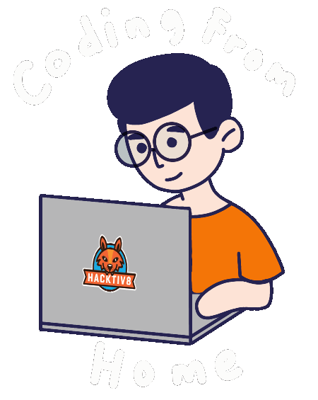
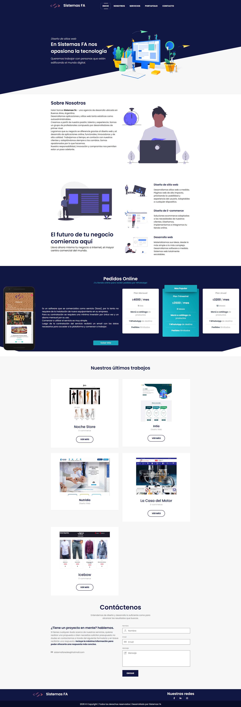
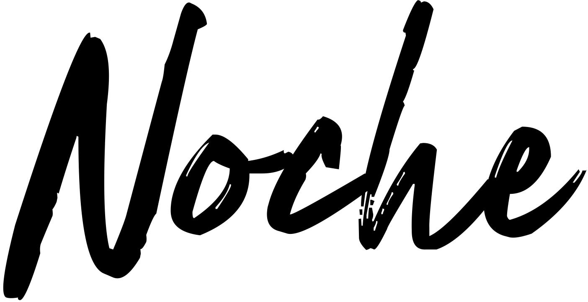
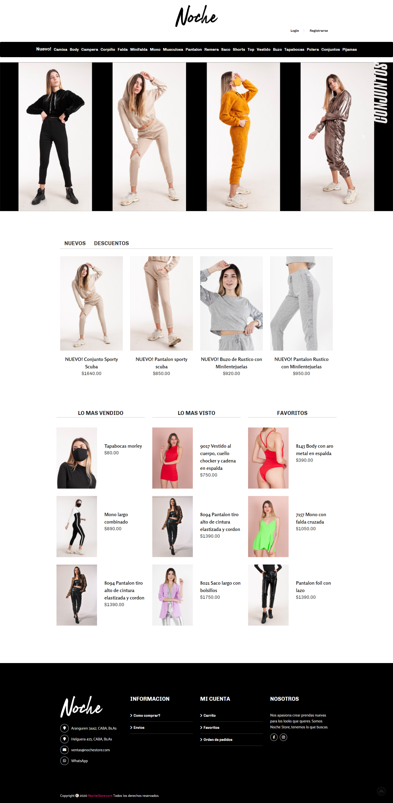
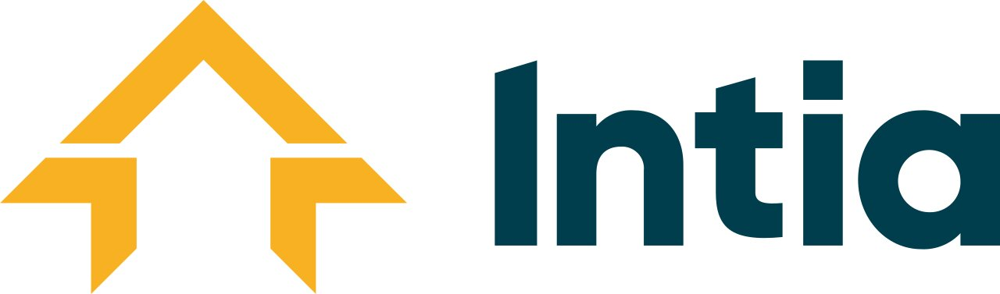
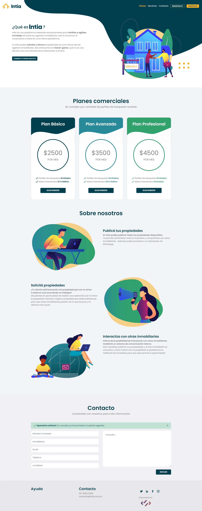
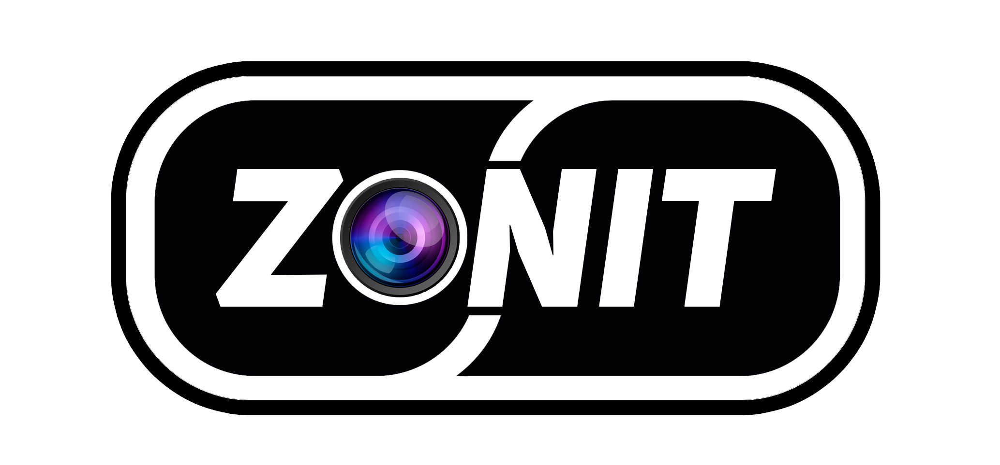
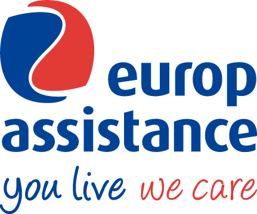

<table>
  <tr>
    <td valign="top" width="180">
      
    </td>
    <td valign="top">
      <h1>Leandro Martin Arroyo</h1>
      <h3>Frontend Developer (React / Next.js / Angular)</h3>
      

        Frontend Developer especializado en <b>React</b>, <b>Next.js</b> y <b>Angular</b>, con experiencia en desarrollo de aplicaciones escalables y optimización de performance. Experiencia en implementación de diseños Figma y mejora de experiencia de usuario en entornos e-commerce. Background en backend que facilita colaboración full-cycle y resolución de problemas complejos.
      

      
      
    </td>
  </tr>
</table>

<h2 align="center">Proyectos Destacados</h2>

Hacé clic en <b>Ver Captura</b> para desplegar la pantalla de cada proyecto.

  

   
  

 

  

   
  

 

  

   
  

 

  

   
  

 

  

   
  

<h2 align="center">Skills</h2>

Tecnologías y herramientas con las que trabajo diariamente.

  
  
  
  
  
  
  
  
  
  
  

